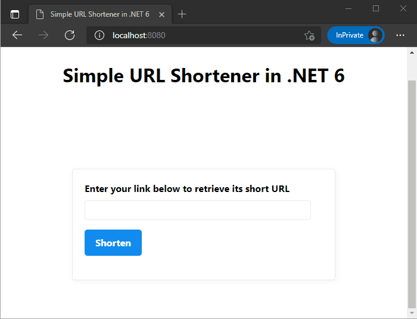
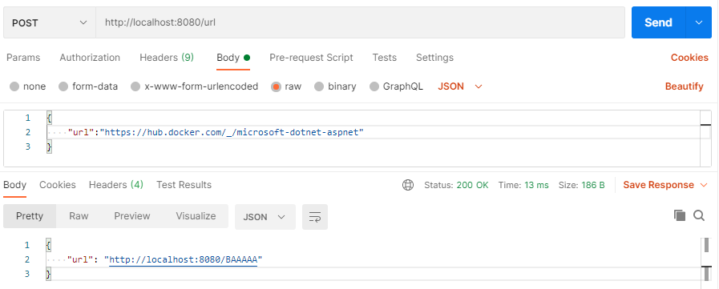

# Minimal APIs in ASP.NET 6

<a href='https://ko-fi.com/changhuixu' target='_blank'></a>

## [Building a URL Shortener Web App using Minimal APIs in .NET 6](https://medium.com/@changhuixu/building-a-url-shortener-web-app-using-minimal-apis-in-net-6-99334ac6e98b)

As announced in the [.NET 6 Preview 4 blog](https://devblogs.microsoft.com/aspnet/asp-net-core-updates-in-net-6-preview-4/), .NET 6 will release an improvement to ASP.NET Core: minimal APIs for hosting and routing in web applications. With these streamlined APIs, we can build microservices and small HTTP APIs with much less ceremony.

In this article, we will first briefly describe the minimal APIs feature in .NET 6. To further demonstrate its use case, we then create a URL shortener web app and containerize it using Docker.

## Minimal APIs

To try out a minimal API, we can create an empty web app using the following command.

```powershell
dotnet new web
```

This command creates a web project with just a single `Program.cs` file, which has the following content.

```csharp
using System;
using Microsoft.AspNetCore.Builder;
using Microsoft.Extensions.Hosting;

var builder = WebApplication.CreateBuilder(args);
await using var app = builder.Build();

if (app.Environment.IsDevelopment())
{
    app.UseDeveloperExceptionPage();
}

app.MapGet("/", (Func<string>)(() => "Hello World!"));

await app.RunAsync();
```

The `Program.cs` file is written in the style of [top-level program](https://devblogs.microsoft.com/dotnet/welcome-to-c-9-0/#top-level-programs), which gets rid of `class Program` and the `Main()` method thus decreases code clutters. In the code above, the first few lines create a web host, then line 13 defines a route in the routing table using the `MapGet` method. We can continue to build more APIs using `MapGet`, `MapPost`, and similar methods.

The API composition is quite different from the traditional API Controller or MVC style. The minimal APIs have really pushed the number of lines of code to an extreme. If our APIs are simply doing some non-essential computation or CRUD operations, then the minimal APIs can reduce a lot of overhead.

If we run the app, we will see the string "`Hello World!`" on the homepage. That's it! With only a few lines of code, we now have a fully functioning HTTP API.

## URL Shortener

For demo purposes, we will create a URL Shortener web app. The app provides a form that allows users to enter a URL to get its shortened version. The app persists the an entry with the original URL and its shortened version. Therefore, the app is able to redirect a shortened URL to its original address. The following screen recording demonstrates the features to be implemented.



### 1. Creating an API to Shorten a URL

In this app, we are going to store the map entries between shortened and original URLs in a local database. A NoSQL database is suitable for this scenario since this app doesn't have complex data relationships. If we don't consider the scalability, then [LiteDB](https://github.com/mbdavid/LiteDB) is a good database candidate. If you haven't heard about it, LiteDB is a small, fast and lightweight .NET NoSQL embedded database, and we can think LiteDB as a combination of SQLite and MongoDB.

After install the LiteDB NuGet package, we can register the `LiteDatabase` in the Dependency Injection (DI) container as follows.

```csharp
var builder = WebApplication.CreateBuilder(args);
builder.Services.AddSingleton<ILiteDatabase, LiteDatabase>(_ => new LiteDatabase("short-links.db"));
await using var app = builder.Build();
```

Then we can create a POST API which takes in a request body with a URL and returns a JSON object contains the shortened URL.

```csharp
app.MapPost("/url", ShortenerDelegate);

static async Task ShortenerDelegate(HttpContext httpContext)
{
    var request = await httpContext.Request.ReadFromJsonAsync<UrlDto>();

    if (!Uri.TryCreate(request.Url, UriKind.Absolute, out var inputUri))
    {
        httpContext.Response.StatusCode = StatusCodes.Status400BadRequest;
        await httpContext.Response.WriteAsync("URL is invalid.");
        return;
    }

    var liteDb = httpContext.RequestServices.GetRequiredService<ILiteDatabase>();
    var links = liteDb.GetCollection<ShortUrl>(BsonAutoId.Int32);
    var entry = new ShortUrl(inputUri);
    links.Insert(entry);

    var result = $"{httpContext.Request.Scheme}://{httpContext.Request.Host}/{entry.UrlChunk}";
    await httpContext.Response.WriteAsJsonAsync(new { url = result });
}

public class UrlDto
{
    public string Url { get; set; }
}

public class ShortUrl
{
    public int Id { get; protected set; }
    public string Url { get; protected set; }
    public string UrlChunk => WebEncoders.Base64UrlEncode(BitConverter.GetBytes(Id));

    public ShortUrl(Uri url)
    {
        Url = url.ToString();
    }
}
```

In the code above, line 1 defines the route `/url` for the POST API, and hooks it up with a request delegate `ShortenerDelegate` to handle HTTP requests. Inside the `ShortenerDelegate` method, we first parse the request body to get the URL and validate its format. Then we resolve the `ILiteDatabase` service from the DI container, and insert an entry into the database. In the end, the delegate method returns the shortened URL as a JSON object.

We model the short URLs as a class `ShortUrl`, where the `Url` property represents the original URL and the `Id` property is auto generated when inserting into the NoSQL database. The `Id` property ensures the uniqueness of each URL in the local database. In order to generate a short URL chunk, we use the `WebEncoders.Base64UrlEncode()` method to convert from an `Id`, an integer, to the `UrlChunk`, a string. Note that you should reference a `using Microsoft.AspNetCore.WebUtilities;` statement to get the method's namespace.

For example, when `Id = 1`, the `UrlChunk` is `AQAAAA`; when `Id = 2`, the `UrlChunk` is `AgAAAA`; and so on. In the next section, we will convert the `UrlChunk` back to the `Id` to get its original `Url` from the local database.

With that, we now have an API endpoint which accepts HTTP POST requests with a JSON body containing a URL string, and returns a JSON object containing a shortened URL string. We can test the API endpoint using Postman.



### 2. Creating an API to Redirect URLs

Now we are going to support another feature for redirecting short URLs to their original URLs. This API has to cover lots of variations, thus the easiest way to catch all URLs is to use the `MapFallback()` method. Also note that we should place this method after all other routes so that those deterministic routes could be matched first.

```csharp
app.MapFallback(RedirectDelegate);

static async Task RedirectDelegate(HttpContext httpContext)
{
    var db = httpContext.RequestServices.GetRequiredService<ILiteDatabase>();
    var collection = db.GetCollection<ShortUrl>();

    var path = httpContext.Request.Path.ToUriComponent().Trim('/');
    var id = BitConverter.ToInt32(WebEncoders.Base64UrlDecode(path));
    var entry = collection.Find(p => p.Id == id).FirstOrDefault();

    httpContext.Response.Redirect(entry?.Url ?? "/");

    await Task.CompletedTask;
}
```

The fallback route is hooked to a `RedirectDelegate`. In this delegate method, we first resolve the `ILiteDatabase` from the DI container and search the short URL from the database. If found, then the API redirects the page to its original URL. Otherwise, the API redirects the page to the app's homepage.

### 3. Creating an API to Serve a Static HTML Page

For this app, we only need a simple HTML page to allow end users to send HTTP requests using an input and a button. Thus we are going to create an `index.html` file and write the user interface there. The web page looks like the following screenshot.

Note that the `index.html` file needs to be included in this project.

Once the `index.html` file is ready, we can register the route as follows.

```csharp
app.MapGet("/", ctx =>
                {
                    ctx.Response.ContentType = "text/html";
                    return ctx.Response.SendFileAsync("index.html");
                });
```

Now we have completed this web application. You can test it out if you have the latest .NET 6 preview version installed. Or we can try out the application using Docker.

### 4. Containerizing Our App

Docker allows us to containerize our applications thus easy to deploy, maintain, and scale. I have prepared a Dockerfile for this app.

```bash
docker run -it mcr.microsoft.com/dotnet/sdk:6.0-alpine sh
/ # dotnet --info
/ # dotnet new web
```

```bash
docker build -t url-shortener-net6 .
docker run -it --rm -p 8080:80 url-shortener-net6
# then visit http://localhost:8080/
```

## License

Feel free to use the code in this repository as it is under MIT license.

<a href='https://ko-fi.com/changhuixu' target='_blank'></a>
